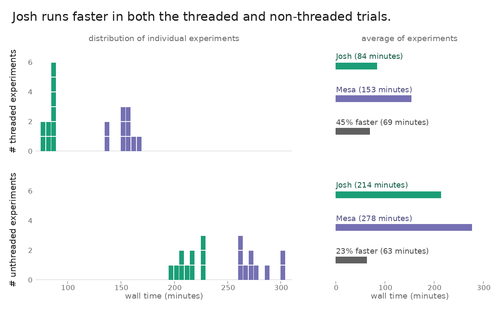

# Josh wall-clock profile

A small, self-contained harness for comparing the wall-clock (and user-CPU) cost of the same "ForeverTree" vegetation model on two runtimes that both use arbitrary-precision decimal arithmetic:

 - [Josh](https://www.joshsim.org/) is a DSL on the JVM
 - [Mesa](https://mesa.readthedocs.io/stable/) is a Python/Mesa implementation.
 
It runs the benchmark either on a single machine or across a cluster, and renders the results to a chart with [Sketchingpy](https://sketchingpy.org/).



## Quickstart
This can run locally across both the Python and JVM-based implementations.

```sh
git clone https://github.com/SchmidtDSE/josh-wall-clock.git
cd josh-wall-clock
bash setup.sh                       # JRE, uv, Josh jar, Mesa venvs

./run_all.sh 100                    # time all four configs on this box
# -> results_<hostname>.csv

python3 -m venv venv                # one-time chart environment
./venv/bin/pip install -r requirements.txt
./venv/bin/python draw_hist.py      # -> draw_hist.png
```

When this is done, `run_all.sh` writes one CSV row per configuration; `draw_hist.py` reads the aggregated `results/all_results.csv` and renders `draw_hist.png`.

## Purpose
Times the identical ForeverTree simulation on two runtimes that both carry every model quantity as an arbitrary-precision decimal, so the comparison isolates runtime/threading behavior rather than numeric shortcuts:

- `reference/`: the Josh DSL on the JVM, which carries every model quantity as a `double`.
- `reference-mesa/`: a Python/Mesa implementation whose per-tree growth math runs entirely in Python's equivalent 64-bit flaot.

Each implementation produces all replicates inside a single process (one JVM for Josh, one long-lived Python interpreter for Mesa) so process startup is paid once per test on both sides. Each of four configurations is timed end-to-end:

| implementation | threaded | description |
|---|---|---|
| josh | false | `--serial-patches` (single-threaded) |
| josh | true  | parallel patches (default) |
| mesa | false | CPython 3.12 (with GIL), `forevertree.py` |
| mesa | true  | free-threaded CPython 3.14t (no-GIL), `forevertree_threaded.py` |

This executes on one machine for a fully local exeuction or across a 40-machine AWS cluster (one config per box, 10 boxes per config) for a stable estimate.

## Setup
Requires Java (for the Josh jar), Python **3.12** and **3.14t** (the pinned mesa 3.5.1 needs ≥3.12; the threaded Mesa config needs free-threaded 3.14t), and `curl`. The easiest path is [`setup.sh`](setup.sh), which provisions everything on an Ubuntu host:

```sh
bash setup.sh
```

It installs a JRE, [uv](https://docs.astral.sh/uv/) (interpreter + venv manager), the Josh runtime jar, and the two Mesa virtualenvs (`reference-mesa/.venv` on 3.12 for serial Mesa, `reference-mesa/.venv-ft` on 3.14t no-GIL for threaded Mesa). The Josh jar is otherwise fetched on demand by `benchmark.sh`/`run_all.sh` from `https://www.joshsim.org/dist/dev/`, and the first Josh run preprocesses the climate inputs into cached `.jshd` files.

The visualization is independent of the benchmark and uses only the Python standard library plus Sketchingpy:

```sh
python3 -m venv venv
./venv/bin/pip install -r requirements.txt
```

Text is rendered in [Lato](https://www.latofonts.com/) when available (`~/Lato2OFL/Lato-Regular.ttf`), falling back to DejaVu Sans.

## Usage
This system can run either locally or remotely on a cluster. Users may also re-use existing results.

### Output file
No matter how the pipeline runs, the following columns are included in the CSV output:

- `hostname`: String hostname where the simulation ran.
- `implementation`: String identifying simulation platform used (josh or mesa).
- `threaded`: Boolean flag indicating if cells were processed in parallel (true) or in serial (false).
- `replicates`: Integer number of replicates that were executed within the simulation
- `cores`: Integer number of CPU cores available when run.
- `wallSeconds`: Floating point total wall clock seconds that it took to execute the simulation.
- `userSeconds`: Floating point total seconds across cores that it took to execute the simulation.

### Pre-built outputs
Results are available in the `results` directory. These come from a cluster execution made up of workers of type `m7i.2xlarge` on AWS. These have 32 GB memory and 8 vCPU cores. This is used for the cached visualization.

### Local execution
Time all four configurations on the current machine:

```sh
./run_all.sh [replicates] [config]   # defaults: 100, all
#   config = all | josh-serial | josh-threaded | mesa-serial | mesa-threaded
```

This warms each config (untimed) and then times it, writing `results_<hostname>.csv`. For a lighter, single-replicate sweep there is also the lower-level profiler:

```sh
./benchmark.sh [replicates] [iterations] [output_file]   # defaults: 1, 10, timestamped CSV
```

Note thgat `wallSeconds` is elapsed real time. Meanwhile, `userSeconds` is user-mode CPU time summed across all threads. Therefore, for threaded configs, `userSeconds` can exceed `wallSeconds` when work runs on multiple cores.

### Distributed execution
Currently designed for AWS,  [`deploy/fleet.sh`](deploy/fleet.sh) drives an EC2 fleet using only the AWS CLI and `ssh`. It launches N instances, assigns **one config per host** round-robin (40 hosts: 10 machines per config, so configs never compete for cores), runs each at `REPLICATES`, and pulls the per-host CSVs back. Credentials come from your environment / `~/.aws` (`aws configure` first).

```sh
export REGION=us-east-2
export REPO_URL=https://github.com/SchmidtDSE/josh-wall-clock.git
./deploy/fleet.sh up        # launch 40 × m7i.2xlarge, write deploy/fleet.txt
./deploy/fleet.sh run       # clone + setup + launch one config per host
./deploy/fleet.sh status    # poll until every host reports DONE
./deploy/fleet.sh collect   # scp results_*.csv -> deploy/results/
./deploy/fleet.sh merge     # concat into deploy/results/all_results.csv
./deploy/fleet.sh down      # terminate the fleet (STOPS BILLING)
```

Fleet shape is configurable via env (`INSTANCE_TYPE`, `COUNT`, `VOLUME_GB`, `KEY_NAME`, `PEM`, `REPLICATES`, …); see the header of `deploy/fleet.sh`. **Always run `down` when finished** as running instances bill until terminated.

### Visualization

`draw_hist.py` reads `results/all_results.csv` and renders `draw_hist.png`:

```sh
./venv/bin/python draw_hist.py
```

The figure pairs, for both the threaded and non-threaded conditions, the **distribution of individual experiments** (overlaid Josh/Mesa histograms, one count per 5-minute wall-time bin) with the **average of experiments** (Josh, Mesa, and the time Josh saved, labeled with the percent reduction).

## Development
Issues and pull requests are welcome. The two halves of the repo — the
wall-clock test and the chart that summarizes it — are independent and can be
worked on separately.

### The wall-clock test
The wall clock test itself uses `run_all.sh` and `benchmark.sh` which are POSIX-ish bash. The two reference implementations live under `reference/` (Josh) and `reference-mesa/` (Mesa). `run_all.sh` is the unit of work: for each config it does an untimed warm-up and then a timed run, appending one row to `results_<hostname>.csv`. A few design points to keep symmetric if you change it:

- Each Josh config rebuilds its `.jshd` preprocessing fresh inside the timed run, so the preprocess pass is included and amortized across the replicates.
- The Mesa references load the climate once per process and reuse it, so their setup is likewise paid once and amortized.
- The timed loop spawns a fresh process per iteration, so the JVM's JIT starts cold each test. Where JIT *does* accumulate is across replicates *within* one test.

`deploy/fleet.sh` wraps this for AWS; its header documents every env knob.

### The visualization

The chart is plain Python using Sketchingpy. Please edit `draw_hist.py` and re-run `./venv/bin/python draw_hist.py` to regenerate `draw_hist.png`. It is organized as a small presenter hierarchy. `MainPresenter` draws the title, subtitles, rotated row labels, and shared axes, then delegates each row to a `TrialPresenter`. This in turn calls a `HistogramPresenter` (left) and an `AveragePresenter` (right). Layout constants and the minute/count scales live at
the top of the file and in the `Layout` class.

## Open Source
This project is built on the work of others, with gratitude:

- [Sketchingpy](https://sketchingpy.org/) under [BSD](https://codeberg.org/sketchingpy/Sketchingpy)
  for the chart rendering.
- [Pillow](https://python-pillow.org/) under
  [MIT-CMU](https://github.com/python-pillow/Pillow/blob/main/LICENSE) for
  Sketchingpy's static (headless) backend.
- [Mesa](https://github.com/projectmesa/mesa) under
  [Apache 2.0](https://github.com/projectmesa/mesa/blob/main/LICENSE) for the
  Python reference agent-based model.
- [NumPy](https://numpy.org/) and [pandas](https://pandas.pydata.org/) under
  [BSD-3-Clause](https://github.com/numpy/numpy/blob/main/LICENSE.txt), and
  [xarray](https://xarray.dev/) under
  [Apache 2.0](https://github.com/pydata/xarray/blob/main/LICENSE), for the
  Mesa data path.
- [netCDF4](https://unidata.github.io/netcdf4-python/) under
  [MIT](https://github.com/Unidata/netcdf4-python/blob/master/LICENSE) for
  reading the synthetic climate inputs.
- [uv](https://github.com/astral-sh/uv) under
  [Apache 2.0 / MIT](https://github.com/astral-sh/uv/blob/main/LICENSE-MIT) for
  provisioning Python interpreters and virtual environments.
- [Lato](https://www.latofonts.com/) under the
  [SIL Open Font License 1.1](https://openfontlicense.org/) for chart
  typography (with [DejaVu](https://dejavu-fonts.github.io/) as a fallback).
- [AWS CLI](https://github.com/aws/aws-cli) under
  [Apache 2.0](https://github.com/aws/aws-cli/blob/v2/LICENSE.txt) for fleet
  orchestration.

This project's code is available under the [BSD 3-Clause License](LICENSE.md).
